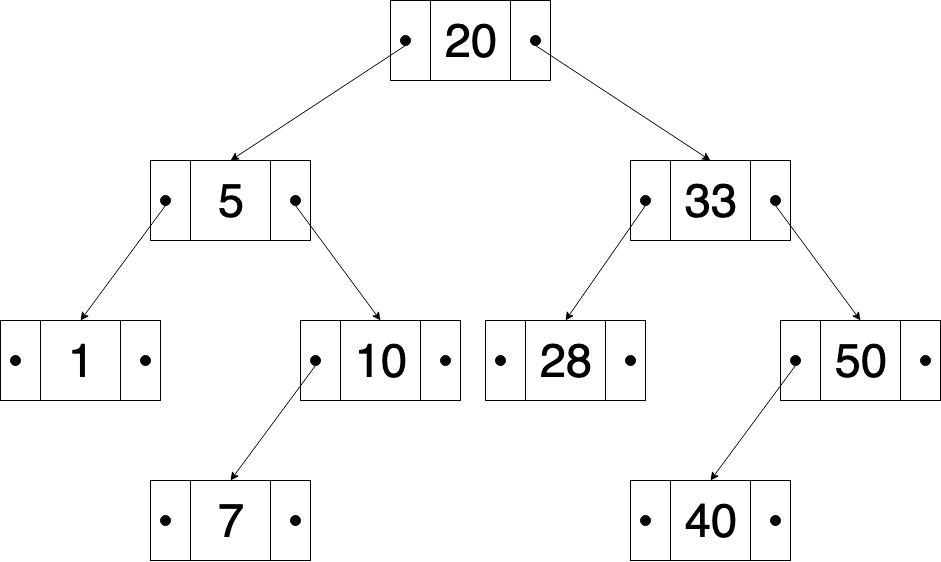

Is a special case of the Binary tree which is **Ordered** sometimes called **Sorted Binary Tree**. In this tree the left subtree of any node only contains nodes with keys lesser than the node’s key and the right subtree of any node only contains nodes with keys greater than the node’s key. In this case the nodes **key** is a special attribute of each node that is used to keep their keys in sorted order, this tree is often used to make searching more efficiently (*fast lookup*) hence the name Binary Search Tree. This tree allows every operation to skip about half of the tree thus making the average complexity of a search operation of **O(log n)**.



## Example

This example demonstrates how to build a Binary Search Tree using Python

### Node class

As with most of our data structures we will start by building the node that will be the foundation of our binary search tree. It is important to note that there a few characteristics that we need to take into account when building this node. First since it’s a tree every node has a left and a right **sub-tree** so we will need the corresponding pointers. Also since it’s an ordered tree aside from any information we might want to store in the node itself it is important to have a field, most commonly named **key** in order to search thru our binary search tree.

``` python
class Node:
    def __init__(self,key):
        self.key = key
        self.left = None
        self.right = None
```

### BinarySearchTree class

Our binary search tree class as in our previous data structures is not more than a **collection of methods** utilized to alter our data structure in many different ways. Methods such as: **add()**, **delete()**, **find()**, **print_tree()**, **pre_order()**, **post_order()**. Ought to be included. However in this example we will be exploring two of these methods: **add()** and **print_tree()**, but writing the rest can be inferred from the methods given in these example. We will be using a recursive approach for these methods because is generally easier to understand and code. But note that it is not always the best solution. Generally a recursive algorithm is more time and ram consuming than an iterative algorithm. Our **print_tree()** algorithm would be equivalent to an **in_order()** method since it prints the elements in an ordered matter. But if tree representation is a must graphviz is a great tool for generating such graph (if you don’t know what graphviz is or how to use it, be sure to check out my post on all thing related graphviz right [here](https://dennismasaya.com/2019/08/07/Graphviz/)).

``` python
class BST:
    def __init__(self):
        self.root = None

    def add(self,node):
        if self.root == None:
            self.root = node
        else:
            self.recursive_add(self.root,node)

    def recursive_add(self,current,node):
        if node.key < current.key:
            if current.left != None:
                self.recursive_add(current.left,node)
            else:
                current.left = node
        elif node.key > current.key:
            if current.right != None:
                self.recursive_add(current.right,node)
            else:
                current.right = node
        else:
            print('error the node currently exists')

    def print_tree(self):
        self.recursive_print(self.root)

    def recursive_print(self,current):
        if current.left != None:
            self.recursive_print(current.left)

        print(current.key,end=',')

        if current.right != None:
            self.recursive_print(current.right)
```

### BinarySearchTree instance

Finally we create a new instance of our BST, add a couple of values and print our tree to check if its working correctly.

``` python
tree = BST()
tree.add(Node(5))
tree.add(Node(7))
tree.add(Node(6))
tree.add(Node(13))
tree.add(Node(3))
tree.print_tree()
```

### Output

Our output should look something like this.

``` bash
3,5,6,7,13
```
